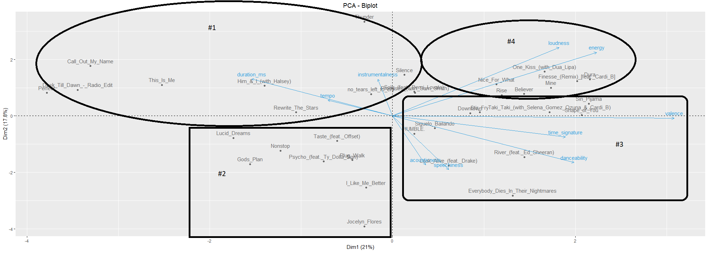
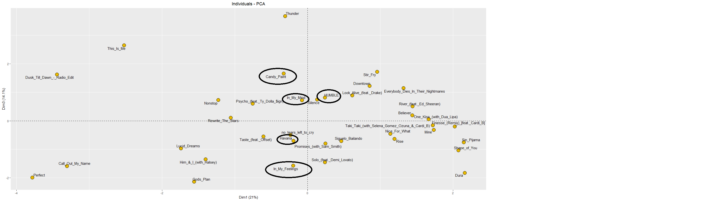

```{r setup, include=FALSE}
knitr::opts_chunk$set(echo = TRUE)


library(FactoMineR)
library(factoextra)
library(ellipse)
library(tidyverse)
library(corrplot)
library(gpairs)
library(FactoMineR)
library(car)
library(GGally)
library(dplyr)
```

# Ejercicio #1

```{r}
setwd("~/ALEJANDRO/1er Ciclo 2023/Mineria de Datos/Tarea 3/Datos de la Presentación y para la Tarea")
datos <- read.table('SpotifyTop2018_40_V2.csv',header=TRUE, sep=',',dec='.')

```

### a) Calcule el resumen numerico, interprete los resultados para dos variables

```{r}
summary(datos)
```

* Variables: 
  + energy: En promedio las canciones son bastantes intensas.
  + Danceability: En promedio son bastante bailables, una buena parte son bailables.

### b) Realice un grafico de dispersion e interprete dos similitudes en el grafico
```{r}

plot(datos,main = "Relación entre las variables", 
     pch = 21, # Tipo de la forma 
     col = "red",# color del los formas del gráfico
     cex.main = .95)
```

* Similitudes
  + Hijos y edad junto con hijos y ocupacion son bastante similares  

### c) Para dos variables identifique los datos atıpicos, si los hay.

```{r}
atipicos<-Boxplot(datos[,c(1,2)],data=datos[,c(1,2)],id.method="y",col="Blue")
atipicos
```

### d) Calcule la matriz de correlaciones, incluya alguna de las imagenes que ofrece R e interprete dos de las correlaciones. Debe ser una interpretacion dirigida a una persona que no sabe nada de estadıstica.
```{r}
matriz.correlacion<-cor(datos)
corrplot(matriz.correlacion)
```

* Correlaciones: 
  + Valence-Danceability: Como se puede observar en el grafico, en el eje de valence y danceability se encuentra un circulo de buen tamannio, lo que significa que estas 2 variables tienen buena correlacion, lo que tiene sentido, porque si una cancion tiene bastante positividad, es posible que tambien sea bastante bailable.Esto se conoce como una correlacion fuerte y positiva.
  + Energy-Duration: Como vemos en el eje donde se cruzan energy y duration, no existe ningun circulo, por lo tanto significa poca correlacion, se debe a que la energia expresada en una cancion no tiene nada que ver con la duracion de la misma


### e) Efectue un ACP y de una interpretacion siguiendo los siguientes pasos:
```{r}
modelo <- prcomp(datos,scale. = TRUE,center = TRUE)
res<-PCA(datos, scale.unit=TRUE, ncp=5, graph = FALSE)
mi.tema <- theme_grey() + theme(panel.border = element_rect(fill = NA,color = "white"), plot.title = element_text(hjust = 0.5))

```

#### En el cırculo de correlacion determine la correlacion entre las variables.
```{r}
fviz_pca_var(res,col.var="steelblue",ggtheme = mi.tema,select.var = list(cos2 = 0.05))

```

* Como se puede observar en el grafico, tenemos 3 clusteres vistosos, los cuales son: 
  + Duration, instrumentalness, tempo. 
  + loudness, energy.  
  + valence, time_signature, danceability, acousticness, speechiness.
  
##### Entre las variables del cluster #1 y las variables del cluster #2 existe una baja correlacion, ya que el angulo es cercano a 90 grados, mientras que entre las variables del cluster #1 y las variables del cluster #3 existe una correlacion fuerte y negativa, es decir, mientras que unas crezcan, las otras se haran mas pequenas. Entre las variables del cluster #2 y el cluster #3 existe tambien poca correlacion, ya que el angulo es cercano a 90 en algunas, exceptuando la correlacion entre variables como #2(loudness,energy)-#3(acousticness,spechiness) donde se obtiene una correlacion fuerte y negativa. Tambien cabe agregar, que entre las variables del mismo cluster, en el caso del #1 y #2, existe una correlacion fuerte y positiva, mientras que entre las variables del cluster #3 existe correlacion fuerte y positiva tambien, exceptuando casos como (acousticness-speechiness)-(valence) donde el angulo tiende a ser 90, osea el coseno del angulo tiende mas a 0, es decir, la correlacion llega a ser baja.


#### Explique la formacion de los clusteres basado en la sobre-posicion del cırculo y el plano
```{r}
fviz_pca_biplot(res,col.var = "#2E9FDF",col.ind = "#696969",ggtheme = mi.tema, select.ind = list(cos2 = 0.05),select.var = list(cos2 = 0.05))
```
Imagen con clusteres



* Gracias al grafico con sobreposicion se aprecia lo siguiente: 
  + Tenemos a simple vista 4 clusteres
  + Los individuos del cluster #1 se relacionan con las variables duration_ms, tempo y instrumentalness.
  + Los individuos del cluster #2 no tienen mucha relacion con ninguna de las variables.
  + Los individuos del cluster #3 tienen relacion con las variables acousticness, speechiness, time_signature, danceability, valence
  + Los individuos del cluster #4 tienen relacion con las variables loudness y energy


#### En el plano de los componentes 1 y 3 interprete las canciones In My Feelings, In My Mind, Havana, Candy Paint y HUMBLE, que son mal representadas en los componentes 1 y 2.

```{r}
fviz_pca_ind(res, pointsize = 5, pointshape = 21, fill = "#E7B800", repel = TRUE, select.ind = list(cos2 = 0.05),ggtheme = mi.tema, axes=c(1, 3))
```


* Segun la imagen, se puede apreciar lo siguiente:
  + "In my Feelings" esta apartada de todas las variables, es decir, tiene bajos numeros en todas las variables.
  + "In my mind" y "Candy Paint"  tiende hacia instrumentalness, es decir, obtuvieron altos numeros en la variable instrumentalness.
  +  Con "Havana" sucede lo mismo que con "In my feelings" 
  +  "Humble" tiende hacia acousticness y speechiness, es decir, obtuvo buenos numeros en estas dos variables. 


# Ejercicio #2


```{r}
setwd("~/ALEJANDRO/1er Ciclo 2023/Mineria de Datos/Tarea 3/Datos de la Presentación y para la Tarea")
datos <- read.table('TablaAffairs.csv',header=TRUE, sep=';',dec='.')
mi.tema <- theme_grey() + theme(panel.border = element_rect(fill = NA,color = "white"), plot.title = element_text(hjust = 0.5))

```


### a) Calcule el resumen numerico, interprete los resultados para una variable
```{r}
datos2 <- datos[, sapply(datos, is.numeric)]
summary(datos2)
```

#### Gracias al resumen que obtuvimos, podemos ver que en la variable Edad, se entrevistaron a personas desde los 17 annios hsta los 57, una buena poblacion. Y que hubieron bastantes personas rondando los 30 annios de edad.

### b) Calcule la matriz de correlaciones, incluya alguna de las imagenes que ofrece R e interprete dos de las correlaciones.Debe ser una interpretacion dirigida a una persona que no sabe nada de estadıstica.

```{r}
matriz.correlacion<-cor(datos2[,-c(1)])
corrplot(matriz.correlacion)
```

* Correlaciones: 
  + Edad-AnnosCasado: Como se puede observar en el grafico, en el eje de Edad y AnnosCasado se encuentra un circulo de buen tamannio, lo que significa que estas 2 variables tienen buena correlacion, lo que tiene sentido, porque si una persona tiene bastante edad, es posible que tambien tenga bastantes mas annos de casado.Esto se conoce como una correlacion fuerte y positiva.
  + Educacion-TiempoInfiel: Como vemos en el eje donde se cruzan Educacion y TiempoInfiel, no existe ningun circulo, por lo tanto significa poca correlacion, ya que la educacion de una persona no tiene nada que ver con el tiempo que ha sido infiel.
  
### c) Usando solo las variables numericas efectue un ACP y de una interpretacion siguiendo lossiguientes pasos: 1) Elimine de los graficos individuos y variables con menos del 5 % de calidad de representacion,
```{r}
res<-PCA(datos2[,-c(1)], scale.unit=TRUE, ncp=5, graph = FALSE)
```

#### 2) en el plano principal encuentre 4 clusteres,
```{r}

fviz_pca_ind(res,col.ind ="steelblue",ggtheme = mi.tema,select.ind = list(cos2 = 0.05))
```


#### 3) en el cırculo de correlacion determine la correlacion entre las variables
```{r}
fviz_pca_var(res,col.var="steelblue",ggtheme = mi.tema,select.var = list(cos2 = 0.05))

```

* **Correlaciones**: 
  + La correlacion entre Educacion y ocupacion es bastante fuerte y positiva, ya que el angulo que se forma entre estas 2 es bastante pequennio.
  + Sucede lo mismo con edad y annosCasado, si lo pensamos, tiene mucha logica, ya que entre mas edad tenga la persona, mas annios de casado puede tener
  + Se podria decir que religioso tiene correlacion fuerte y positiva con edad y annosCasado, sin embargo, tiene poca correlacion con la educacion y la ocupacion, ya que el angulo que se forma es cercano a 90 grados, osea que el coseno llega a dar un valor cercano a 0.
  + (Edad,AnosCasado)-(Educacion,Ocupacion) tambien tienen poca correlacion, ya que sucede lo mismo que en el punto anterior


####  4) explique la formacion de los clusteres basado en la sobre-posicion del cırculo y el plano.

```{r}
fviz_pca_biplot(res,col.var = "#2E9FDF",col.ind = "#696969",ggtheme = mi.tema, select.ind = list(cos2 = 0.05),select.var = list(cos2 = 0.05))

```


* **Clusteres**: 
  + Cluster #1: Son indivduos los cuales no tienen mucha relacion a ninguna de las variables, es decir, los numeros son bajos.
  + Cluster #2: Son individuos que tienen numeros altos en ocupacion y educacion, ya se que lleven varios annios.
  + Cluster #3: Son individuos en los cuales la edad y los annios de casado son numeros bastane altos, por eso tienden mas hacia estas dos variables. Tambien se asocian con el TiempoInfiel. Entre mas annios tengas mas tiempo de infiel van a tener
  + Cluster #4: Son individuos que se inclinan hacia la variable religioso, y otras mas abajo son individuos que no se inclinan hacia ninguna variable, pero se se acercan a religioso.


### d) Ahora convierta las variables Genero e Hijos en Codigo Disyuntivo Completo y repita el ACP ¿Se gana interpretabilidad al convetir Genero e Hijos en Codigo Disyuntivo Completo?

```{r}
datos <- datos %>%dplyr::mutate(Genero = dplyr::recode(Genero,"male" = 1,"female" = 0))

datos <- datos %>% dplyr::mutate(Hijos = dplyr::recode(Hijos,"yes" = 1, "no" = 0))

datos <- datos %>% dplyr::mutate(Valoracion = dplyr::recode(Valoracion,
                                                            "muy infeliz" = 0,
                                                            "infeliz" = 1,
                                                            "neural"=2,
                                                            "feliz"=3,
                                                            "muy feliz"=4))

resDis<-PCA(datos, scale.unit=TRUE, ncp=5, graph = FALSE)
fviz_pca_biplot(resDis,col.var = "#2E9FDF",col.ind = "#696969",ggtheme = mi.tema, select.var = list(cos2 = 0.05), axes=c(1, 2))

```

#### Como tal, una mejor interpretabilidad no se genera, ya que lo cambia es en realidad demasiado poco, sin embargo se aprecian pequennos cambios, como la correlacion entre el genero-educacion-ocupacion y la correlacion entre hijos-religioso-anniosCasado.


# EJERCICIO 3

## PARTE A
```{r}
setwd("~/ALEJANDRO/1er Ciclo 2023/Mineria de Datos/Tarea 3/Datos de la Presentación y para la Tarea")
datos <- read.table('SAheart.csv',header=TRUE, sep=';',dec='.')
mi.tema <- theme_grey() + theme(panel.border = element_rect(fill = NA,color = "white"), plot.title = element_text(hjust = 0.5))

```

### a) Efectue un ACP usando solo las variables numericas y de una interpretacion siguiendo los siguientes pasos (para todos los ejercicios elimine de los graficos individuos y variables con menos del 5 % de calidad de representacion):

```{r}
datos2 <- datos[, sapply(datos, is.numeric)]
summary(datos2)
res<-PCA(datos2, scale.unit=TRUE, ncp=5, graph = FALSE)

```


#### En el plano principal encuentre los clusteres.
```{r}
fviz_pca_ind(res,col.ind ="steelblue",ggtheme = mi.tema,select.ind = list(cos2 = 0.05))

```


#### En el cırculo de correlacion determine la correlacion entre las variables.
```{r}
fviz_pca_var(res,col.var="steelblue", select.var = list(cos2 = 0.05),ggtheme = mi.tema, axes=c(1, 2))
```

* **Correlaciones**: 
  + Existe una fuerte y positiva correlacion entre alcohol y tobbaco
  + Poca correlacion entre (alcohol,tobacco) y (ldl,adiposity, obesity, sbp, age)
  + Existe tambien poca correlacion entre (tobacco, alcohol) y (ldl,adiposity, obesity, sbp, age)
  + Entre ldl-adiposity-obesity existe una correlacion fuerte y positiva.
  + Existe buena correlacion entre sbp y age
  + En las que la correlacion es fuerte y positiva es porque el angulo que se forma es bastanante pequennio, por lo tanto, el coseno de ese angulo tendera a dar 1 o un valor cercano.
  + Y si la correlacion es baja o casi nula, es porque el angunlo esta cerca de 90 y coseno de ese angulo tiende a dar 0


#### Explique la formacion de los clusteres basado en la sobre-posicion del cırculo y el plano
```{r}
fviz_pca_biplot(res,col.var = "#2E9FDF",col.ind = "#696969",ggtheme = mi.tema, select.ind = list(cos2 = 0.05),select.var = list(cos2 = 0.05))
```

* **Clusteres**: 
  + Cluster #1: Son indivduos los cuales no tienen mucha relacion a ninguna de las variables, es decir, los numeros son bajos o directamente no tienen relacion entre si.
  + Cluster #2: Son individuos que tienen numeros altos en las variables alcohol-tobacco-sbp y age, podrian ser individuos con vicios
  + Cluster #3: Son individuos que tienen numeros altos en las variables ldl-adiposity-sbp y obesity, lo que tiene sentido, ya que si una persona sufre de obesidad, tendra una gran adiposidad, que significa acumulacion de grasa en el cuerpo.
  
## PARTE B

```{r}
datos <- datos %>%
  dplyr::mutate(famhist = dplyr::recode(famhist,
                                        "Present" = 1,
                                        "Absent" = 0))
str(datos)
datos <- datos %>%
  dplyr::mutate(chd = dplyr::recode(chd,
                                    "Si" = 1,
                                    "No" = 0))

res<-PCA(datos, scale.unit=TRUE, ncp=5, graph = FALSE)
```


#### En el plano principal encuentre los clusteres.
```{r}
fviz_pca_ind(res,col.ind ="steelblue",ggtheme = mi.tema,select.ind = list(cos2 = 0.05))

```


#### En el cırculo de correlacion determine la correlacion entre las variables.
```{r}
fviz_pca_var(res,col.var="steelblue", select.var = list(cos2 = 0.05),ggtheme = mi.tema, axes=c(1, 2))
```

* **Correlaciones**: 
  + Existe una fuerte y positiva correlacion entre alcohol, tobbaco,chd y famhist
  + Poca correlacion entre alcohol y (ldl,adiposity, obesity, sbp, age)
  + Existe buena correlacion entre sbp y age
  + Existe tambien poca correlacion entre (tobacco,chd,famhist) y (ldl,adiposity, obesity, sbp, age)
  + Entre ldl-adiposity-obesity existe una correlacion fuerte y positiva.
  + En las que la correlacion es fuerte y positiva es porque el angulo que se forma es bastanante pequennio, por lo tanto, el coseno de ese angulo tendera a dar 1 o un valor cercano.
  + Y si la correlacion es baja o casi nula, es porque el angunlo esta cerca de 90 y coseno de ese angulo tiende a dar 0


#### Explique la formacion de los clusteres basado en la sobre-posicion del cırculo y el plano
```{r}
fviz_pca_biplot(res,col.var = "#2E9FDF",col.ind = "#696969",ggtheme = mi.tema, select.ind = list(cos2 = 0.05),select.var = list(cos2 = 0.05))
```

* **Clusteres**: 
  + Cluster #1: Son indivduos los cuales no tienen mucha relacion a ninguna de las variables, es decir, los numeros son bajos o directamente no tienen relacion entre si.
  + Cluster #2: Son individuos que tienen numeros altos en las variables alcohol-tobacco-sbp y age, podrian ser individuos con vicios, pero que tambien se relaciona con famhist y chd.
  + Cluster #3: Son individuos que tienen numeros altos en las variables ldl-adiposity-sbp y obesity, lo que tiene sentido, ya que si una persona sufre de obesidad, tendra una gran adiposidad, que significa acumulacion de grasa en el cuerpo.


### Explique las diferencias de este ACP respecto al anterior (usando solo las variables numericas). ¿Cual le parece mas interesante? ¿Por que?


##### En realidad, no existen muchas diferencias, ya que los 2 son muy parecidos en la forma en que se sobreponen y proyectan las variables e individuos. Me parece bastante mas interesante el de las variables solo numericas, ya que nos permite ver lo mismo que el que contiene las variables categoricas, sin tener que recodificarlas. Ademas de que los dos son bastante acertados.


